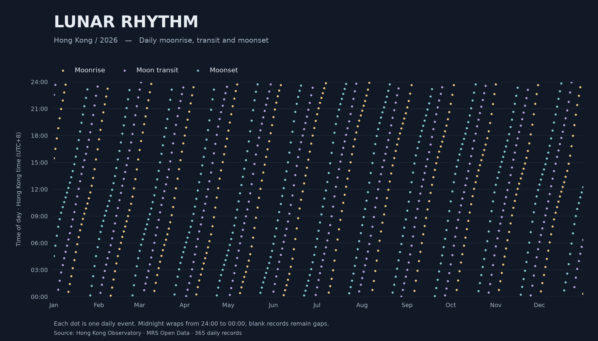

# Lunar Rhythm — Hong Kong, 2026



## The phenomenon

The times when the Moon rises, crosses the local meridian and sets change throughout the year. I chose these daily changes because their repetition creates a visual rhythm. This project uses a readable scatter plot to explore that rhythm across 2026. It visualises event times, rather than the illuminated shape or phase of the Moon.

## The source

The data comes from the [Hong Kong Observatory MRS CSV endpoint](https://data.weather.gov.hk/weatherAPI/opendata/opendata.php?dataType=MRS&year=2026&rformat=csv). The unchanged reply is saved in `data/hko-moonrise-moonset-2026.csv`. It contains 365 daily rows, with the columns `YYYY-MM-DD`, `RISE`, `TRAN.` and `SET`. Times are given as hours and minutes in Hong Kong time (UTC+8). Empty cells represent days without that particular event within the calendar day; they remain missing values in the plot.

## What the picture shows

Each dot places one event at its date and clock time, with gold for moonrise, lavender for transit and cyan for moonset. Repeated diagonal bands reveal the changing daily schedule, while the midnight boundary causes patterns to wrap from the top to the bottom. The picture hides the Moon’s brightness, altitude between events and phase; it does not show continuous paths or calculate how long the Moon is above the horizon.

## Run it

```bash
uv run fetch.py
uv run plot.py
```
